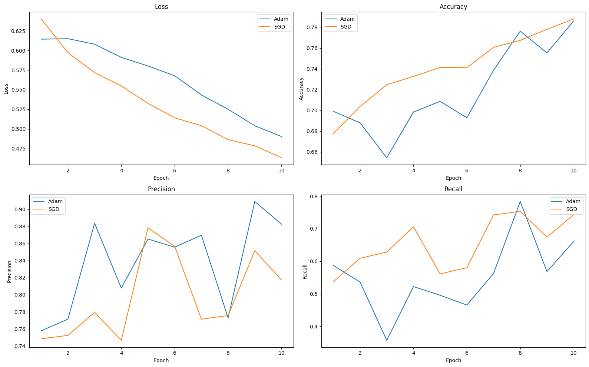
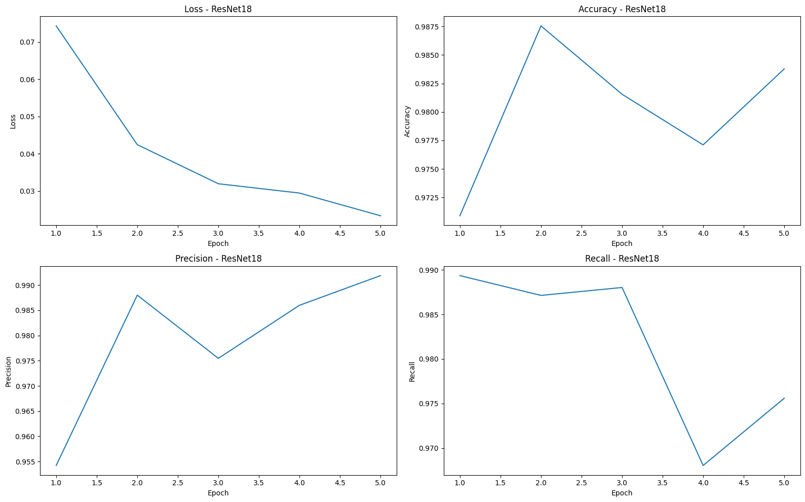
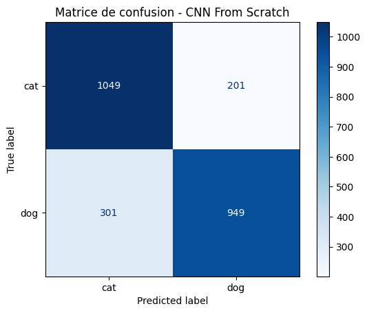
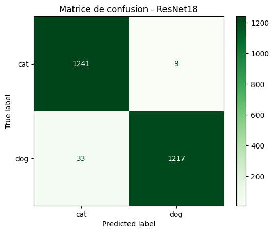

# cnn-catsdogs-DonBosenga

# CNN From Scratch vs Transfer Learning (Cats vs Dogs) Classification
---
## 1. Objectif du projet

Ce projet compare les performances d'un réseau de neurones convolutionnel (CNN) construit à partir de zéro (from scratch) avec celles d'un modèle de transfert d'apprentissage (transfer learning) pré-entraîné pour la classification d'images de chats et de chiens.
Les performances des deux approches sont comparées à l’aide des métriques suivantes :

- Accuracy
- Precision
- Recall
- Loss
---
## 2. Environnement de développement

### Création et activation de l’environnement virtuel

```bash
python3 -m venv .venv
source .venv/bin/activate # Sur Windows : .venv\Scripts\activate
```

### Installation des dépendances

```bash
pip install -r requirements.txt
```
---
## 3. Organisation des données

Le jeu de données n’est pas inclus dans le dépôt GitHub afin de respecter les contraintes de taille.

### Structure des dossiers

```
data/
└── cat_dog_data/
    ├── train/
    │   ├── cat/
    │   └── dog/
    │
    └── test/
        ├── cat/
        └── dog/
```

Le projet utilise un découpage :

- Entraînement : 18 000 images
- Validation : 4 500 images
- Test : 2 500 images
---

## 4. Reproductibilité

Afin de garantir la reproductibilité des expériences :

```python
SEED = 42
```

### Dépendances principales

- torch
- torchvision
- numpy
- matplotlib
- pandas
- scikit-learn
- jupyter

## Utilisation du GPU

Les expériences ont été exécutées sur un MacBook Pro M3 utilisant l'accélération matérielle Apple Metal Performance Shaders (MPS) lorsque disponible.

```python
device = torch.device("mps" if torch.backends.mps.is_available() else "cpu")
```
---
## 5. Experience A : CNN From Scratch

### Architecture

Le modèle CNN est composé de :

- Conv2D (32 filtres)
- Batch Normalization
- ReLU
- Max Pooling
- Conv2D (64 filtres)
- Batch Normalization
- ReLU
- Max Pooling
- Conv2D (128 filtres)
- Batch Normalization
- ReLU
- Max Pooling
- Flatten
- Dense (256 neurones)
- Dropout (0.5)
- Dense (2 neurones)

### Entraînement

```
Batch Size : 32
Epochs : 10
Optimiseurs testés :
- Adam (lr = 0.001)
- SGD (lr = 0.001, momentum = 0.9)
```

Regularisation : Dropout (0.5) et Batch Normalization

### Sauvegarde du modèle

```
best_cnn_scratch_adam.pth
best_cnn_scratch_sgd.pth
```
---
## 6. Experience B : Transfer Learning

### Modèle pré-entraîné

Le modèle de transfert d’apprentissage utilisé est ResNet18 pré-entraîné sur ImageNet.

### Stratégie d’entraînement

Fine-tuning du modèle complet:

```python
for param in resnet18.parameters():
    param.requires_grad = True
```

La dernière couche de classification est remplacée afin de produire deux classes :

- Cat
- Dog

### Entraînement

```
Batch Size : 32
Epochs : 5
Optimiseurs testés : Adam (lr = 0.0001)
```

### Sauvegarde du modèle

```
best_resnet18.pth
```
---
## 7. Évaluation des modèles

### Recharger un modèle sauvegardé :

```python
model.load_state_dict(
    torch.load(
        "best_resnet18.pth",
        map_location=device
    )
)
```

### Métriques d’évaluation calculées sur le jeu de test :

- Accuracy
- Precision
- Recall
- Loss
---
## 8. Résultats

### CNN From Scratch

| Optimiseur | Accuracy | Precision | Recall  |
| ---------- | -------- | --------- | ------- |
| Adam       | 79.92 %  | 88.26 %   | 66.06 % |
| SGD        | 78.80 %  | 81.74 %   | 74.27 % |

### Transfer Learning

| Modèle   | Accuracy | Precision | Recall  |
| -------- | -------- | --------- | ------- |
| ResNet18 | 98.32 %  | 99.27 %   | 97.36 % |

### Comparaison finale

| Modèle                     | Accuracy    | Precision   | Recall      |
| -------------------------- | ----------- | ----------- | ----------- |
| CNN From Scratch           | 79.92 %     | 88.26 %     | 66.06 %     |
| ResNet18 Transfer Learning | **98.32 %** | **99.27 %** | **97.36 %** |
---
## 9. Courbes d’apprentissage (loss et accuracy) et Matrices de confusion pour les deux expériences :

### Courbes d’apprentissage

#### CNN From Scratch

- `cnn_scratch_loss_accuracy.png`
  

#### ResNet18

- `resnet18_loss_accuracy.png`
  

### Matrices de confusion

#### CNN From Scratch



#### ResNet18


---
## 10. Analyse des résultats

Les résultats montrent que le CNN développé à partir de zéro est capable d’apprendre efficacement les caractéristiques visuelles des images et atteint une accuracy proche de 80 %.
Cependant, le modèle ResNet18 utilisant le transfert d’apprentissage atteint une accuracy supérieure à 98 %, avec une précision et un rappel également très élevés. Cette amélioration importante s’explique par les représentations visuelles déjà apprises sur le jeu de données ImageNet contenant plusieurs millions d’images.
Le transfert d’apprentissage permet donc une convergence plus rapide, une meilleure généralisation et des performances nettement supérieures à celles obtenues avec un entraînement From Scratch.
---
## 11. Bonus implémentés

Les éléments suivants ont également été réalisés :

- Découpage Train / Validation / Test
- Data Augmentation
- Matrice de confusion
- Sauvegarde et rechargement des modèles
- Utilisation du GPU lorsque disponible
- Comparaison de plusieurs optimiseurs
---
## 12. Limites et pistes d’amélioration

- Augmenter le nombre d’époques pour le CNN From Scratch afin d’améliorer ses performances.
- Tester d’autres architectures de CNN plus profondes ou plus complexes.
- Expérimenter avec d’autres modèles de transfert d’apprentissage (EfficientNet, MobileNet, etc.).
---
## 13. Exécution du projet

1. Cloner le dépôt GitHub :

```bash
git clone https://github.com/DonBos27/cnn-catsdogs-DonBosenga.git
cd cnn-catsdogs-DonBosenga
```

2. Télécharger et organiser les données dans le dossier `data/cat_dog_data/`.
3. Installer les dépendances :

```bash
pip install -r requirements.txt
```
---
## 14. Conclusion

Ce projet a permis de démontrer l’efficacité du transfert d’apprentissage pour la classification d’images, avec des performances nettement supérieures à celles obtenues avec un CNN développé à partir de zéro. Le modèle ResNet18 pré-entraîné a su exploiter les représentations visuelles apprises sur ImageNet pour atteindre une accuracy de 98.32 %, tandis que le CNN From Scratch a atteint une accuracy de 79.92 %. Ces résultats soulignent l’importance du transfert d’apprentissage dans les tâches de vision par ordinateur, en particulier lorsque les ressources de calcul et les données d’entraînement sont limitées.
